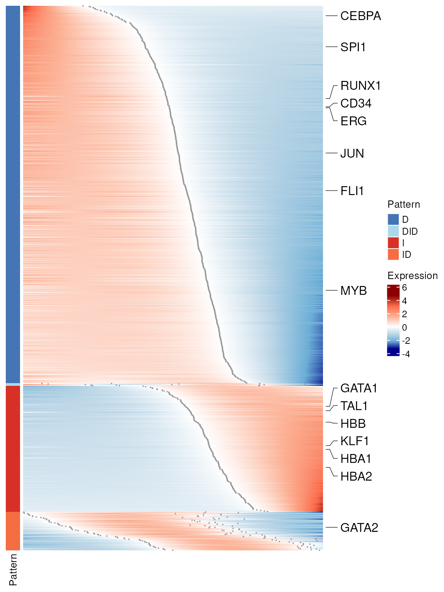
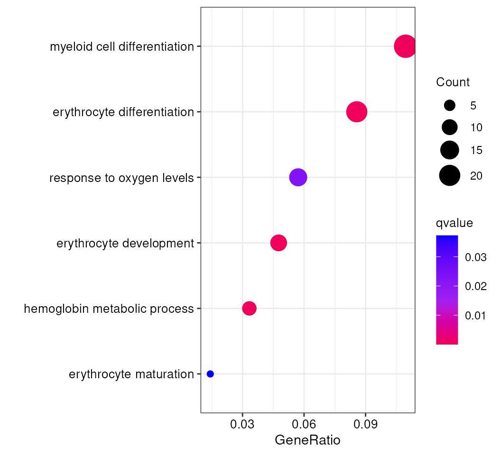
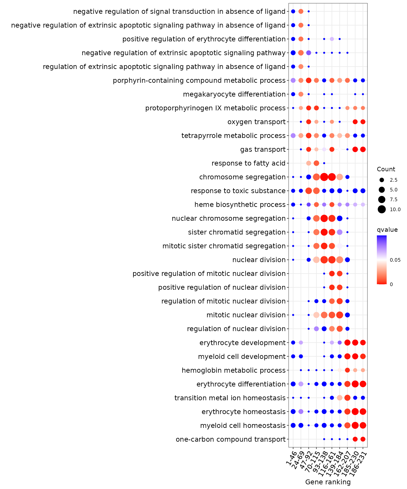
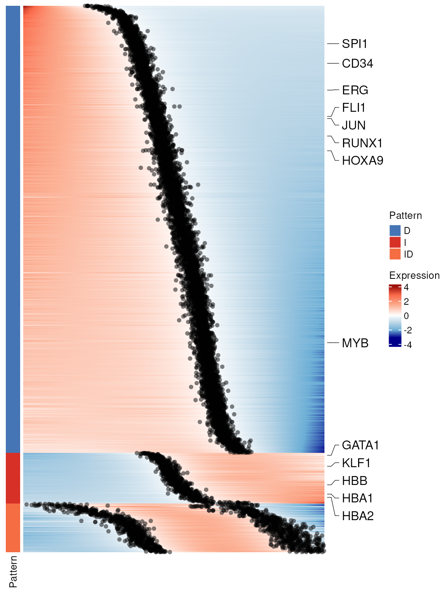

# Get started with Pseudotimecascade

## Example: Pseudotimecascade Analysis on human bone marrow samples

This tutorial introduces the `Pseudotimecascade` R package, a toolkit
for modeling gene expression dynamics along pseudotime trajectories in
single-cell RNA-seq data. The method identifies genes with switch-like
temporal expression patterns and supports downstream biological
interpretation through GO enrichment analysis.

We demonstrate the complete workflow starting from a Seurat object with
clustering and dimensionality reduction. The key steps include: -
Computing pseudotime using `TSCAN` or other tools  
- Fitting gene trajectories with
[`fitData()`](https://changxinw.github.io/Pseudotimecascade/reference/fitData.md)  
- Classifying gene patterns with
[`genePattern()`](https://changxinw.github.io/Pseudotimecascade/reference/genePattern.md)  
- Visualizing dynamic genes with heatmaps  
- Performing enrichment analysis (group-based and bin-based)  
- Integrating multi-sample results to assess reproducibility

The pipeline is modular and compatible with any pseudotime method, as
long as cells are assigned a numeric pseudotime value. While we
illustrate the process using `TSCAN` and specific marker genes from
hematopoietic lineages, the same framework can be applied to other
systems and datasets.

All steps shown here are directly reproducible using your own Seurat
object. Replace file names and cluster IDs as needed to fit your
biological context.

Let’s get started.

## Step 1: Load data and generate pseudotime for cells

In this tutorial, we start from a processed Seurat object that contains
gene expression, and dimensionality reduction (e.g., PCA, UMAP). From
this object, users can apply a trajectory inference method such as
TSCAN, Monocle3, Slingshot, or RNA velocity to obtain a biologically
meaningful ordering of cells along pseudotime. The only requirement is
that each cell receives a numeric pseudotime value, which defines its
position along the trajectory. Using this ordering, the expression
matrix can be arranged so that rows correspond to genes and columns
correspond to cells ordered by pseudotime, with expression values
log-normalized and scaled for comparability across genes. Here, we
include a pre-processed example object with pseudotime values, but in
practice users can start from their own scRNA-seq data and apply the
same workflow with any pseudotime inference method.

## Step 2: Fit pseudotime expression using `Pseudotimecascade`

With cells ordered by pseudotime and the corresponding expression matrix
prepared, we next call the core fitting function
[`fitData()`](https://changxinw.github.io/Pseudotimecascade/reference/fitData.md).
Here `expr_df` is obtained from the <RNA@data> slot of the Seurat
object, with columns restricted to the cells that have been sorted by
their pseudotime values. This gives a gene-by-cell expression matrix
where each row is a gene and each column is a cell ordered along the
trajectory, effectively capturing the pseudo-temporal dynamics of gene
expression.

The pseudotime vector `pt` provides the numeric position of each cell
along this trajectory and must be aligned with the same cell order used
in `expr_df`. The argument `new_data` specifies the pseudotime grid on
which predictions will be made, and mc.cores sets the number of parallel
processes. The output `fit_data_list` contains the fitted expression
trajectories, estimated switch points, and statistical metrics that form
the basis for downstream pattern classification and enrichment analysis.

``` r
library(Pseudotimecascade)

# Ensure cells are ordered by pseudotime
cells_order <- rownames(obj@meta.data[order(obj$tscan_pseudotime), ])
expr_df <- obj@assays$RNA@data[, cells_order]

# Fit gene curves
fit_data_list <- fitData(
  as.matrix(expr_df),
  pt = obj$tscan_pseudotime[cells_order],
  new_data = data.frame(pt = seq(1, nrow(obj@meta.data))),
  mc.cores = 4
)
```

Tip: Because this step involves fitting curves for thousands of genes,
it can be computationally intensive; for example, running with mc.cores
= 4 typically requires around three hours for one thousand genes.

## Step 3: Classify gene patterns

Once smooth trajectories have been fitted, the next step is to identify
the major temporal expression patterns across genes. The function
[`genePattern()`](https://changxinw.github.io/Pseudotimecascade/reference/genePattern.md)
takes the fitted expression matrix from
[`fitData()`](https://changxinw.github.io/Pseudotimecascade/reference/fitData.md)
and classifies each gene into a discrete category, such as increasing,
decreasing, or biphasic.

These categories provide an intuitive summary of how genes behave along
pseudotime, highlighting switch-like dynamics or more complex expression
changes. The output is a data frame where each row corresponds to a gene
and columns provide its assigned pattern, the estimated switch point (if
applicable), and a ranking statistic for visualization.

In this tutorial, we store the fitted expression matrix, the list of fit
results, and the gene-level pattern assignments together in a single
object (`pseudo_list`), which will serve as the input for downstream
heatmaps and enrichment analyses.

``` r
gene_group <- genePattern(as.data.frame(fit_data_list[["data"]]))

pseudo_list <- list(
  expr_df = expr_df,
  fit_data = fit_data_list,
  gene_group = gene_group
)
```

## Step 4: Select genes and plot Pseudotimecascade heatmap

To make the visualization clearer and computationally efficient, we do
not plot all genes at once. Instead, we select the top 1,000 most
significant genes based on their q-values from the fitting step, and
then subsample cells by keeping every tenth cell along pseudotime. This
produces a reduced expression matrix that still preserves the global
dynamics but avoids overplotting.

In addition to these filtered genes, we also highlight a set of manually
chosen marker genes relevant for hematopoietic differentiation. These
marker genes are annotated on the heatmap, making it easier to track
known regulators and to interpret the overall expression trends in a
biological context.

The function
[`PseudotimeHeatmap()`](https://changxinw.github.io/Pseudotimecascade/reference/PseudotimeHeatmap.md)
automatically orders genes by their assigned expression pattern and
estimated switch point location, and produces a heatmap where each row
is a gene and each column a pseudotime-sampled cell. This view provides
a compact summary of dynamic gene expression programs along the
trajectory.

``` r
library(Pseudotimecascade)

pseudo_list <- readRDS(
  system.file("extdata", "pseudo_list.rds", package = "Pseudotimecascade")
)

# Match and sort gene pattern labels
hsc_genes <- c('ERG', 'HOXA5', 'HOXA9', 'HOXA10', 'LCOR', 'RUNX1', 'SPI1', "CD34")
cmp_genes <- c('GATA2', 'CEBPA', 'GATA1', 'SPI1', 'EKLF', 'FLI1','ZFPM1',
               'TAL1', 'GFI1', 'JUN', 'EGR1', 'EGR2', 'NAB2')
ery_genes <- c('GATA1', 'TAL1', 'KLF1', 'LDB1', 'ZFPM1', 'ZBTB7A', 'MYB', "HBB", "HBA1", "HBA2")
mon_genes <- c('SPI1', 'IRF8', 'KLF4', 'ERG1', 'JUN', 'JUNB', 'STAT1', 'STAT3', 'CEBPB')
marked_genes <- unique(c(hsc_genes, cmp_genes, ery_genes))

# Plot heatmap
p <- PseudotimeHeatmap(
  x = pseudo_list$fit_data,
  gl = marked_genes,
  annotation = as.matrix(pseudo_list$gene_group)[, "pattern"],
  show_sp = TRUE,
  switch_point = setNames(pseudo_list$gene_group$switch_point, rownames(pseudo_list$gene_group))
)

p
```



## Step 5: Enrichment analysis

We identify enriched biological processes for pseudotime-dynamic genes
using two complementary approaches. **Group-based enrichment** applies
GO analysis to genes grouped by temporal expression pattern (e.g., “I”,
“D”, “ID”), while **bin-based enrichment** uses a sliding window along
switch points to detect transient functional signals. Both approaches
are run on the same set of top-ranked genes (e.g., top 1000 by q-value),
ordered by pattern and switch point.

### 5.1: Group-Based Enrichment

Group-based enrichment in `Pseudotimecascade` is carried out using the
[`enrichPattern()`](https://changxinw.github.io/Pseudotimecascade/reference/enrichPattern.md)
function, which is specifically designed for temporal gene expression
analysis. Given a gene grouping table produced by
[`genePattern()`](https://changxinw.github.io/Pseudotimecascade/reference/genePattern.md),
users can call
[`enrichPattern()`](https://changxinw.github.io/Pseudotimecascade/reference/enrichPattern.md)
to test for functional overrepresentation within one specific pattern
(e.g., “I” or “D”) or across all patterns at once.

This function automatically extracts the genes belonging to the chosen
pattern and performs GO enrichment against a user-defined background
(the `universe`). In practice, the universe is set to all genes detected
in the dataset after preprocessing, ensuring that enrichment is
interpreted relative to the expressed gene set. This analysis links
temporal gene expression dynamics to biological processes, highlighting
enriched functions associated with distinct pseudotime patterns.

``` r
# Order gene pattern labels
ggene_group <- pseudo_list[["gene_group"]][rownames(pseudo_list[["fit_data"]][["data"]]), ]
gene_group <- gene_group[order(gene_group$pattern, gene_group$rank_point), ]

# Perform GO enrichment for each pattern
enrich_group_list <- enrichPattern(
  gene.group = gene_group,
  species = "human",
  universe = universe,
  ont = "BP"
)

# Save results
saveRDS(enrich_group_list, "pseudo_group_enrichment.rds")
```

Tip: You may later visualize these results as shown in Step 6.1.

### 5.2: Bin-Based Enrichment

Bin-based enrichment is implemented in `Pseudotimecascade` through the
function
[`compareEnrichBin()`](https://changxinw.github.io/Pseudotimecascade/reference/compareEnrichBin.md).
Unlike group-based enrichment, which aggregates all genes in a pattern,
this method applies a sliding window along pseudotime within each
pattern. The window is defined by two parameters: bin.width (the size of
each window along pseudotime) and stride (the step size between
windows). This allows us to detect biological processes that are
transiently enriched at specific points in the trajectory.

In the example below we demonstrate how to run
[`compareEnrichBin()`](https://changxinw.github.io/Pseudotimecascade/reference/compareEnrichBin.md)
on genes assigned to the `"I"` pattern. The background gene set
(`universe`) is the same as in the group-based analysis.

``` r
# Example: perform bin-based enrichment on "I" pattern genes
pattern <- "I"
bin.width <- 0.2
stride <- 0.1

# Run bin-based enrichment
genes_bin_enrich <- compareEnrichBin(
  gene_group,
  pattern = pattern,
  bin.width = bin.width,
  stride = stride,
  species = "human",
  ont = "BP",
  universe = universe
)

# Save results
saveRDS(genes_bin_enrich, "pseudo_bin_enrichment.rds")
```

Tip: While we demonstrate bin-based enrichment using the `"I"` pattern
here, the full analysis can be performed across all expression patterns.
Visualization of bin-based enrichment in Pattern `"I"` is shown in Step
6.2.

## Step 6: Visualization of GO Enrichment Results

After identifying gene patterns using `Pseudotimecascade`, we visualize
enriched GO terms associated with each pattern. Here we demonstrate both
**group-based** and **bin-based** enrichment results.

### 6.1: Group-Based Enrichment Visualization

Group enrichment analyzes the overrepresentation of GO terms among genes
from a specific pattern (e.g., `"I"`, `"D"`, `"ID"`, etc.). In
`Pseudotimecascade`, this is implemented through the enrichment
functions described in Step 5, and the results can be visualized to
highlight key GO terms through the function
[`plotEnrichGroup()`](https://changxinw.github.io/Pseudotimecascade/reference/plotEnrichGroup.md).

Here we demonstrate how to visualize the enrichment results for the
`"I"` pattern, where users can either supply a predefined list of GO
terms to highlight specific processes or rely on top-ranked terms
returned by the enrichment analysis.

``` r
# Load enrichment result
obj_enrich <- readRDS(system.file("extdata", "pseudo_group_enrichment.rds", package = "Pseudotimecascade"))

# Pattern of interest (e.g., "I" or "D")
group <- "I"

# Select GO terms 
terms <- c("GO:0048821", "GO:0030218", "GO:0030099", "GO:0020027", "GO:0043249", "GO:0070482")

# Visualize group-based enrichment result
p <- plotEnrichGroup(obj_enrich[[group]],
                       terms = terms)
p
```


This plot shows GO enrichment for genes with increasing expression along
pseudotime. Dot size indicates the number of genes (Count), the x-axis
shows the fraction of increasing genes annotated to each GO term
(GeneRatio), and color reflects enrichment significance (q-value).

Tip: In addition to manual selection, users may also automatically
display the top N enriched GO terms ranked by q-value for unbiased
exploration.

### 6.2: Bin-Based Enrichment Visualization

In addition to group-wise enrichment, `Pseudotimecascade` supports
bin-based enrichment through the function
[`compareEnrichBin()`](https://changxinw.github.io/Pseudotimecascade/reference/compareEnrichBin.md),
which evaluates how functional categories appear at different pseudotime
windows within each expression pattern. The results can then be
visualized using the companion function
[`plotEnrichBin()`](https://changxinw.github.io/Pseudotimecascade/reference/plotEnrichBin.md),
which generates a bubble plot of enriched terms across bins. This
workflow allows users to detect transient biological processes that may
be enriched only within specific pseudotime windows, complementing the
broader insights from group-based enrichment.

``` r
# Load bin-based enrichment result
genes_bin_enrich <- readRDS(system.file("extdata", "pseudo_bin_enrichment.rds", package = "Pseudotimecascade"))

# Pattern of interest (e.g., "I" or "D")
pattern <- "I"
n <- 5
qval <- 0.05

p <- plotEnrichBin(genes_bin_enrich[[pattern]], n = n, qval_cutoff = qval)
p
```



The x-axis shows pseudotime bins (clusters of genes grouped by their
switch point location), and the y-axis lists GO terms that are
significantly enriched within each bin. Dot size reflects the number of
genes (Count) annotated to each GO term, while dot color indicates
enrichment significance (q-value). For clarity, only the top 5 GO terms
per bin with q-value ≤ 0.05 are shown. This visualization highlights
biological processes that are transiently enriched at different stages
along pseudotime.

Tip: You can adjust pattern, n, and qval_cutoff to explore different
enrichment structures or other gene dynamics.

## Step 7: Multi-sample Pseudotimecascade Analysis

In this section, we demonstrate how to integrate `Pseudotimecascade`
results across multiple samples to identify reproducible gene patterns
and switch point trends. This allows more robust functional inference
across donors or biological replicates.

We first integrate gene-level trends across samples using
[`PseudotimeMSProcess()`](https://changxinw.github.io/Pseudotimecascade/reference/PseudotimeMSProcess.md).
For each gene, sample-specific pattern labels are retained only if the
gene passes the q-value threshold (default qval = 0.05). A consensus
pattern is then assigned as the most frequent pattern across samples,
and a confidence score is computed as the proportion of samples
supporting this dominant pattern. Genes with confidence greater than or
equal to conf = 0.75 (default) are retained.

This integration step returns a structured list object containing the
averaged fitted expression trajectory across valid samples
(`mean_expr`), the consensus pattern labels derived from the mean
trajectory (`mean_pattern`), a consensus pattern table with confidence
scores (`df_pattern`), the filtered q-value matrix aligned to retained
genes (`df_qvalue`), and a collection of sample-wise switch point
interval matrices (`df_switch_point`). These components together provide
the foundation for downstream ranking, enrichment analysis, and
multi-sample heatmap visualization.

After multi-sample integration, we further restrict the analysis to the
top-ranked genes using the
[`SelectTopGenes()`](https://changxinw.github.io/Pseudotimecascade/reference/SelectTopGenes.md)
function. This step selects a subset of genes with the strongest overall
statistical support across samples and subsets all associated components
(mean expression, consensus patterns, q-values, and switch points)
accordingly.

In this tutorial, we retain the top 1000 genes for visualization and
downstream analysis.

These outputs are used for downstream enrichment analysis and
multi-sample heatmap visualization.

Below we visualize selected lineage marker genes from the top 1000 most
significant genes, using the
[`PseudotimeHeatmapMS()`](https://changxinw.github.io/Pseudotimecascade/reference/PseudotimeHeatmapMS.md)function.

### 7.1: Multi-sample integration (code example)

The following code shows how to integrate eight single-sample
Pseudotimecascade results.

Because the full multi-sample object is large and not included in the
package, this chunk is provided for illustration and is not evaluated.

``` r
gene_mean_list <- PseudotimeMSProcess(stip_list)
top_mean_list <- SelectTopGenes(gene_mean_list, top=1000)
```

### 7.2: Visualize reproducible patterns and switch-point heterogeneity

Below we load a precomputed multi-sample result (top 1,000 genes)
distributed with the package and visualize lineage marker genes using
[`PseudotimeHeatmapMS()`](https://changxinw.github.io/Pseudotimecascade/reference/PseudotimeHeatmapMS.md).
The heatmap rows follow the consensus pattern ordering, while the
overlaid points/segments summarize sample-level switch-point
heterogeneity.

``` r
library(Pseudotimecascade)

# Load Pseudotimecascade results from multi-sample integration
top_mean_list <- readRDS(system.file("extdata", "pseudo_list_multi_sample.rds", package = "Pseudotimecascade"))

# Define marker genes
hsc_genes <- c('ERG', 'HOXA5', 'HOXA9', 'HOXA10', 'LCOR', 'RUNX1', 'SPI1', "CD34")
cmp_genes <- c('GATA2', 'CEBPA', 'GATA1', 'SPI1', 'EKLF', 'FLI1','ZFPM1', 
               'TAL1', 'GFI1', 'JUN', 'EGR1', 'EGR2', 'NAB2')
ery_genes <- c('GATA1', 'TAL1', 'KLF1', 'LDB1', 'ZFPM1', 'ZBTB7A', 'MYB', "HBB", "HBA1", "HBA2")
marked_genes <- unique(c(hsc_genes, cmp_genes, ery_genes))

# Draw heatmap
p <- PseudotimeHeatmapMS(
  x = top_mean_list[["mean_expr"]],
  gl = marked_genes,
  annotation = as.matrix(top_mean_list[["mean_pattern"]])[, "pattern"],
  interval = top_mean_list[["df_switch_point"]],
  use_raster = FALSE
)
p
```



Enrichment analysis can also be applied to the multi-sample results in
the same way as for a single sample (see Step 5). Specifically, both
group-based enrichment (using
[`enrichPattern()`](https://changxinw.github.io/Pseudotimecascade/reference/enrichPattern.md))
and bin-based enrichment (using
[`compareEnrichBin()`](https://changxinw.github.io/Pseudotimecascade/reference/compareEnrichBin.md))
can be applied to the mean_pattern matrix.

For visualization of enriched GO terms, we recommend reusing the
approaches from Step 6. Together, these visualizations will reveal how
functional categories are enriched in specific patterns or transiently
emerge at distinct pseudotime windows, providing a dynamic view of
biological processes along the trajectory.
